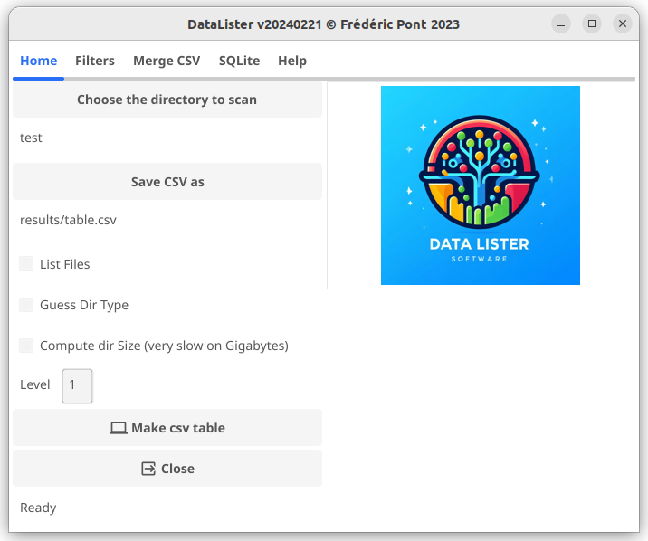
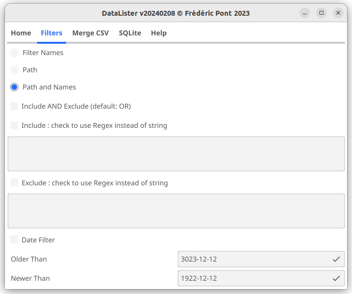

 <!-- -->


<p align="center">

</p>

# DATA Lister
 DATA Lister is a software to list directories/files and produce a TSV table for data management.






Caution : set the directory level to a reasonable value before starting DATA Lister on a large file system to avoid producing a huge result table.

## Key characteristics
- List directories and optionally files.
- TSV table output
- SQLite output/update
- Tunable dir level
- Try to guess dir content based on footprint (level must be set to dir +1 to allow the dir content analysis)
- Unlimited number of customizable dir footprint
- Include/Exclude filter list by unlimited number of string or regex
- Filter by date
- Unlimited number of custom (pre-filed) columns
- Compute directory size (slow on terabytes of data because 100% of the files are parsed)
- Merge tool to update old table with the new rows from a new analysis

## Installation

No installation required the code is statically compiled.

- Download the zip file from the "<>Code" green button and unzip it 
- or `git clone https://github.com/FredPont/Data_Lister.git`

## Quick start

- Edit config/settings.json to set root directory and options
```json
{
    "InputDir": "test",
    "OutputCSVFile": "results/table.csv",
    "OutputSQLFile": "test/testDB.db",
    "ListFiles": false,
    "GuessDirType": false,
    "CalcSize": false,
    "Level": 3,
    "filterName": false,
    "filterPath": false,
    "filterPathName": true,
    "IncludeRegex": false,
    "Include": [
        ""
    ],
    "IncludeAndExclude": false,
    "ExcludeRegex": false,
    "Exclude": [
        ""
    ],
    "OlderThan": "3023-12-12",
    "NewerThan": "1922-12-12",
    "DateFilter": false,
    "UseSQLite": false,
    "SQLiteTable": "table1",
    "CompiledIncludeRegex": null,
    "CompiledExcludeRegex": null
}
```
Use absolute path in "InputDir", "OutputCSVFile" or "OutputSQLFile".
Note : for the command line version, backslashes must be escaped in regex in the settings.json file (this is not necessary in the GUI). 

Example : to exclude names starting with a dot use "^\\..+"

- The filter priority is Date > Include > Exclude
- If more than one string/regex is given they are cumulated (reg1 OR reg2)
- If Include and Exclude are used simultaneously, they are cumulated (Include OR Exclude) if "Include AND Exclude" is not checked
- Edit config/DirSignatures.json to set the directory patterns (strings, no regex)
```json
{
    "Software": {
                "content": [".go", ".git", ".DLL", ".dll", ".r", ".jl", ".pl"],
                "scoreThreshold": 0.2
    },
    "Fasta": {
            "content": [".fasta", ".FASTA", ".fasta.gz"],
            "scoreThreshold": 0.8
    }
}
```
- Edit config/columns.tsv to add custom columns and their optional default values
```tsv
ColumnName	DefaultValueswork in progress...
SampleType	Cells
Project_ID	Project_1
RelatedProject	Project_2
content	MyExperiments
Delete_Date	2028-01-01
```
- Start the software using the precompiled binaries for Linux, Mac or Windows
```bash
Usage :
  -c	Start DataLister directories analysis in command line.
  -g	Start DataLister directories analysis in graphic mode.
  -m	Start DataLister merging tool.
  -i string
    	New result file path. Only new files/dir are added to the old file
  -o string
    	Old result file path. 

      Examples :

      Start the analysis of the directories in command line (-c):
      ./Linux_DataLister.bin -c

      Start the analysis of the directories in graphic mode (-g):
      ./Linux_DataLister.bin -g

      To add new data from newfile to oldfile :
      ./Linux_DataLister.bin -m -o oldfile.csv -i newfile.csv
```

<!-- ## Known issues
In some computers, the pop up window showing the end of the analysis can freeze. To close the application click on the up right corner.
-->